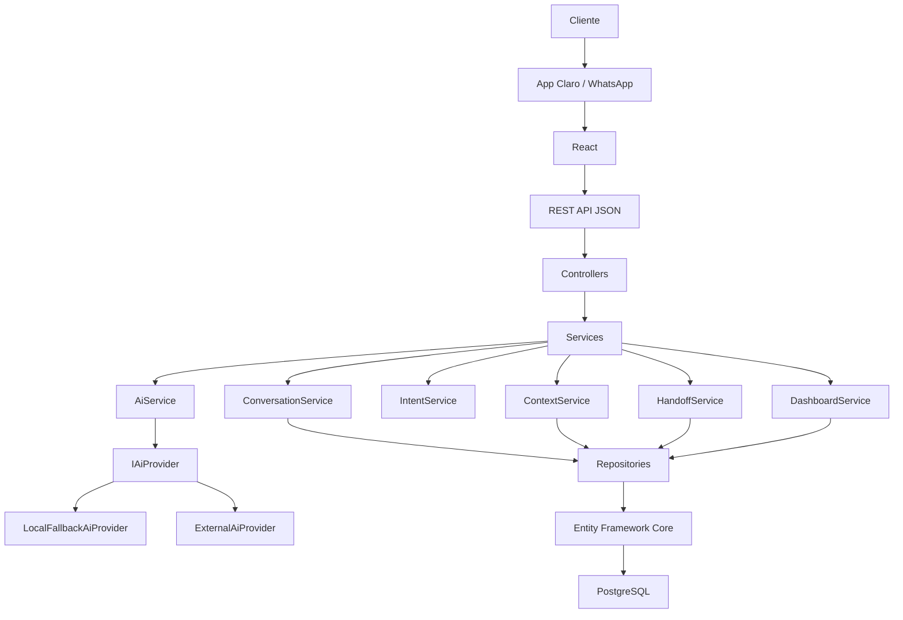
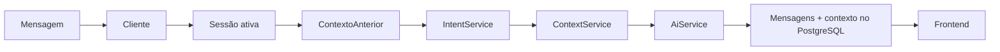

# Arquitetura da CIA

Este documento descreve a arquitetura realmente implementada na versão funcional da Sprint 3.

## Visão geral

A CIA — Claro Inteligência Artificial — é uma aplicação em três camadas:

1. Interface React que simula App Claro e WhatsApp.
2. API REST em ASP.NET Core.
3. Banco relacional PostgreSQL, acessado por Entity Framework Core.

O diferencial técnico é a preservação de contexto entre canais. A sessão, o protocolo, as mensagens e o contexto não ficam no React: são persistidos no PostgreSQL e recuperados pelo backend.

## Frontend

O frontend fica em `/frontend` e usa React, Vite e TypeScript.

Responsabilidades:

- Renderizar o chat do cliente e o dashboard administrativo.
- Enviar mensagens para `POST /api/chat/message`.
- Trocar o canal por `POST /api/sessions/{id}/channel`.
- Solicitar transbordo por `POST /api/sessions/{id}/handoff`.
- Exibir protocolo, status, histórico e resumo devolvidos pela API.

A URL da API é centralizada em `src/services/api.ts` via `VITE_API_URL`.

## ASP.NET Core

O backend fica em `/backend`.

`Program.cs` configura:

- CORS para `http://localhost:5173`
- Swagger em `/swagger`
- EF Core com PostgreSQL
- Injeção dos repositórios e serviços
- Middleware global de erros
- Aplicação automática da migration e seed

## API REST

Os controllers apenas recebem HTTP e delegam para serviços:

| Controller | Função |
| --- | --- |
| `HealthController` | Saúde da API |
| `CustomersController` | Consulta do cliente |
| `SessionsController` | Sessão, canal e handoff |
| `ChatController` | Envio de mensagem |
| `AdminController` | Dashboard e detalhe administrativo |

A API devolve DTOs, não as entidades do Entity Framework.

## Services

| Serviço | Responsabilidade |
| --- | --- |
| `ConversationService` | Orquestra identificação do cliente, sessão, mensagem, intenção, contexto e resposta |
| `ContextService` | Recupera, atualiza e persiste o contexto da jornada |
| `IntentService` | Classifica a mensagem em intenções conhecidas |
| `AiService` | Encaminha geração de resposta e resumo para `IAiProvider` |
| `HandoffService` | Cria o resumo estruturado e marca a sessão como `Transferred` |
| `DashboardService` | Consolida indicadores e detalhes para o `/admin` |
| `ProtocolService` | Gera protocolos no formato `CIA-YYYYMMDD-0001` |

## Repositories

Os repositórios isolam o acesso a dados:

- `CustomerRepository`
- `SessionRepository`
- `MessageRepository`
- `ContextRepository`
- `HandoffRepository`

## Entity Framework Core e PostgreSQL

`AppDbContext` mapeia:

- `Customer`
- `ConversationSession`
- `Message`
- `ConversationContext`
- `Handoff`

Relacionamentos:

- Um cliente possui várias sessões.
- Uma sessão possui várias mensagens.
- Uma sessão possui um contexto.
- Uma sessão pode ter um ou mais transbordos.

## Gerenciamento de contexto

Fluxo real de uma mensagem:

Quando o cliente diz que a internet não funciona, o contexto grava `IssueType = InternetConnection`.

Quando informa que já reiniciou o modem, o contexto grava `ModemRestarted = true`.

Esses valores ficam no banco e são lidos de novo ao continuar no WhatsApp.

## Inteligência artificial

A abstração `IAiProvider` possui:

- `AnalyzeIntentAsync`
- `GenerateResponseAsync`
- `GenerateHandoffSummaryAsync`

Implementações:

- `LocalFallbackAiProvider`: regras locais suficientes para o fluxo de demonstração.
- `ExternalAiProvider`: usado apenas se `Ai:ApiKey` estiver configurada. Em falha, volta para o fallback.

## Troca de canal

`POST /api/sessions/{id}/channel` atualiza somente `CurrentChannel` da sessão já existente.

Não cria outra sessão.

Não gera outro protocolo.

O frontend evidencia visualmente App Claro e WhatsApp.

## Transbordo

`HandoffService` gera um resumo com cliente, protocolo, canais, problema e procedimentos já realizados.

A sessão passa para `SessionStatus.Transferred`.

## Dashboard

`GET /api/admin/dashboard` calcula totais a partir das sessões persistidas.

`GET /api/admin/sessions/{id}` devolve cliente, contexto, mensagens e handoff reais.

Não há números fixos no frontend.
