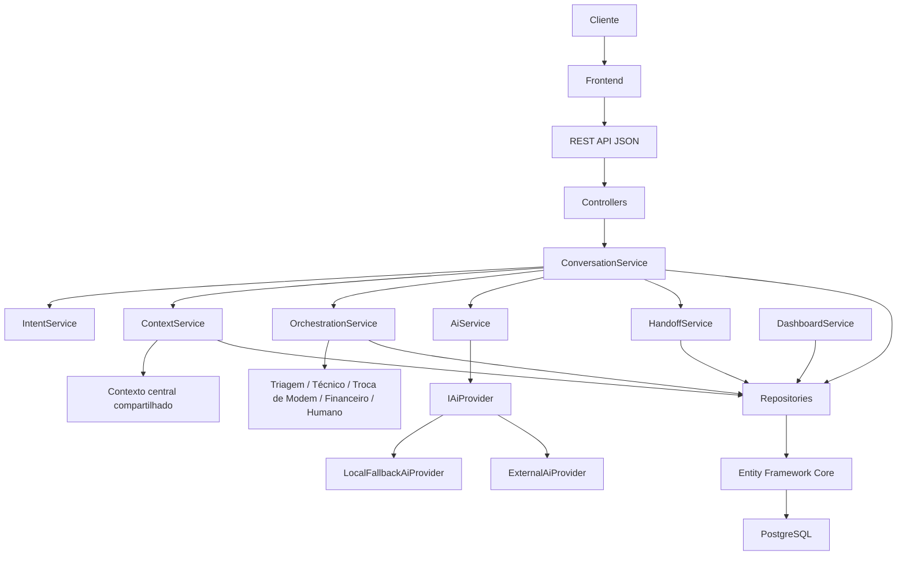

# Arquitetura da CIA

Este documento descreve a arquitetura realmente implementada.

## Visão geral

A CIA — Claro Inteligência Artificial — é a camada central de orquestração e memória compartilhada do atendimento da Claro.

Ela integra diferentes fluxos e áreas, preservando o contexto do cliente durante redirecionamentos para evitar que ele precise repetir informações já fornecidas.

Os bots e áreas **não** são donos do histórico. A CIA é dona do contexto.



## Frontend

O frontend fica em `/frontend` e usa React, Vite e TypeScript.

Responsabilidades:

- Exibir área atual, protocolo, histórico e jornada entre departamentos.
- Enviar mensagens para `POST /api/chat/message`.
- Permitir transferência manual de área em `POST /api/sessions/{id}/department`.
- Solicitar transbordo por `POST /api/sessions/{id}/handoff`.
- Mostrar no `/admin` o contexto, as transferências e o resumo humano.

A URL da API é centralizada em `src/services/api.ts` via `VITE_API_URL`.

## ASP.NET Core

O backend fica em `/backend`.

`Program.cs` configura CORS, Swagger, EF Core, injeção de dependências, middleware de erros, migration e seed.

## API REST

| Controller | Função |
| --- | --- |
| `HealthController` | Saúde da API |
| `CustomersController` | Consulta do cliente |
| `SessionsController` | Sessão, departamento e handoff |
| `ChatController` | Envio de mensagem |
| `AdminController` | Dashboard e detalhe administrativo |

A API devolve DTOs, não as entidades do Entity Framework.

## Services

| Serviço | Responsabilidade |
| --- | --- |
| `ConversationService` | Orquestra mensagem, sessão, intenção, contexto e resposta |
| `ContextService` | Recupera e persiste o contexto compartilhado |
| `IntentService` | Classifica a intenção da mensagem |
| `OrchestrationService` | Decide a área responsável e registra a transferência |
| `AiService` | Gera resposta e resumo com base no contexto |
| `HandoffService` | Cria o resumo da jornada para atendimento humano |
| `DashboardService` | Consolida indicadores e detalhe administrativo |
| `ProtocolService` | Gera protocolos `CIA-YYYYMMDD-0001` |

Fluxo de uma mensagem:

```
Mensagem → ConversationService → IntentService → ContextService → OrchestrationService → área atual → resposta
```

## Contexto compartilhado

`ConversationContext` guarda no PostgreSQL:

- problema original
- tipo do problema
- se o modem foi reiniciado
- se a internet continua fora
- procedimentos realizados
- pedido atual
- fatos importantes
- resumo do contexto

`DepartmentTransfer` registra a jornada:

Triagem → Suporte Técnico → Troca de Modem → Financeiro → Atendimento Humano

Ao trocar de área permanecem o mesmo cliente, a mesma sessão, o mesmo protocolo, o mesmo histórico e o mesmo contexto.

## Inteligência artificial

`IAiProvider` gera respostas a partir do contexto persistido. Sem chave externa, `LocalFallbackAiProvider` cobre o fluxo de demonstração. Se `ModemRestarted = true`, a CIA não pergunta novamente se o modem já foi reiniciado.

## Transbordo humano

`HandoffService` gera um resumo com problema original, jornada entre áreas, procedimentos e status `Transferred`.

## Dashboard

O `/admin` mostra totais por status e por área, além do detalhe com contexto, mensagens, jornada e handoff.
